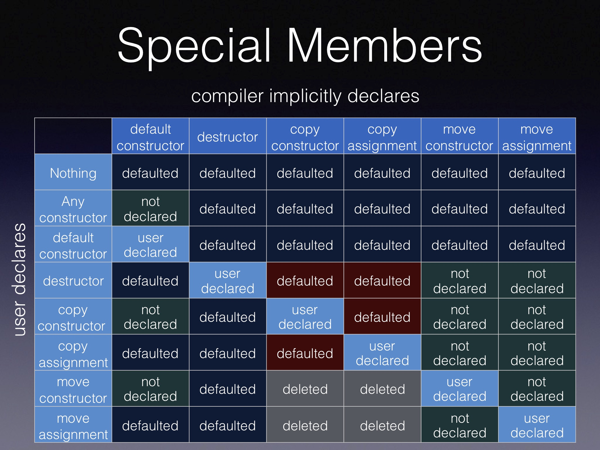

# Introduction

The [rule-of-five](https://en.cppreference.com/w/cpp/language/rule_of_three) states that, if a class `C` has one of **user-declared** 

- Destructor `~C()`
- Copy constructor `C(const C&)`
- Copy assignment operator `C& operator=(const C&)`
- Move constructor `C(C&&)`
- Move assignment operator `C& operator=(C&&)`

it should declare all five special member functions.

User-declared `!=` User-provided. Any explicitly defaulted (`=default`) or deleted (`=delete`) functions count as user-declared. 

A function is *user-provided* if it is user-declared and not explicitly defaulted or deleted. 

# Trivial special member functions

Special member functions can be trivial. They are trivial, if they’re not user provided (i.e. they use `= default` or are implicitly generated), and the corresponding function of all the members/base classes are also trivial. Trivial default constructors and destructors do nothing, whereas trivial copy/move constructors/assignment operator essentially do a `std::memcpy`. `std::memcpy` dispatches to the fastest possible way of copying raw bytes. 

# Hinnant Table

The infamous [Hinnant table](https://howardhinnant.github.io) elaborates the various special members implicitly generated by the compiler in the presence of **user-declared** special functions. 

