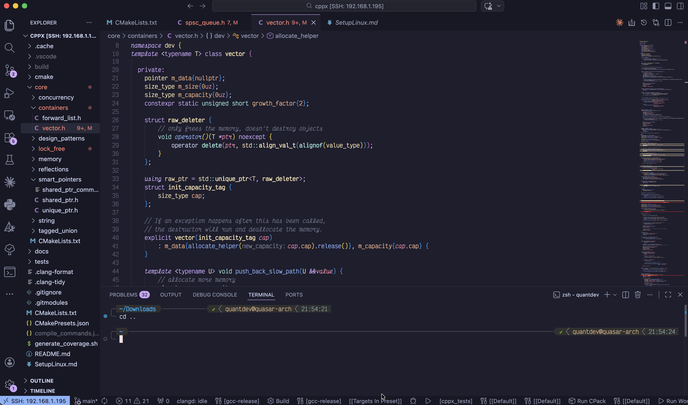

# Introduction

This blog post is a guide on setting up a modern C++ development environment. This can be especially helpful, if you are getting started with C++. 



Here is a very brief primer on building C++ code.

## C++ Compiler

A compiler translates C++ source code into low-level machine code (targeted to a specific architecture, for example x86_64, ARM etc). More specifically, each source file is translated into an object file, that contains machine code. Object files are little pieces of machine code, that can be linked together. 

A function declared with external linkage can be referred to from the scopes of other translation units. 

When a compiler compiles a call to such a function(or more generally symbols) `foo()` in the this translation unit, it has no idea where `foo()` is defined, so it leaves a placeholder in all calls to `foo()` in the object file.

When a compiler compiles (the definition of) a function with external linkage, the compiler writes the machine code of that function at some memory location, and puts the address of that memory location and the function name in `.o` file, where the linker can find it.

`gcc/g++`, `clang/clang++`, `msvc` are examples of major compilers.

## Linker

The basic job of a linker is simple : it binds symbol references such as calls to `foo()` to the specific memory address of the function `foo()`'s definition. 

The linker takes as its input, a set of input object files, other libraries and produces as its output a library or executable. Each input file contains a set of *segments*, contiguous blocks of code or data to be placed in the output file. Each input file also contains at least one symbol table. Some symbols are exported - defined within thew file for use in other files, generally the names of routines within that file that can be called from elsewhere. Other symbols are imported - used in the file but not defined, generally the names of routines called from but not present in the file. 

When a linker runs, it first scans the input files to find the sizes of the segments and to collect the definitions and references of all of the symbols. It creates a segment table listing all of the segments defined in the input files and a symbol table of all symbols imported/exported. 

The second pass uses the information collected in the first pass to control the actual linking process. It reads and relocates the object code, substituting numeric addresses for symbol references and adjusting memory addresses in code and data to reflect relocated segment addresses, and writes the relocated code to the output file. 

A static library (`.a` files) is just a little more than a set of object code files catenated together. Shared (dynamic) libraries move some of the work from link time to load time. The linker identifies the shared libraries gthat resolve the undefined names in a linker run, but rather than linking anything into the program, the linker notes in the output file the names of the libraries in which symbols were found, so that the shared library can be bound when the program is loaded.

## Loader

Loading is the process of bringing program into main memory. 

## Build system

While a hobby project starts out simple enough that you can build it just using a compiler, as your system grows more complex, it can quickly become unwieldy. Sure enough, you can write a script, but you begin spending almost as much time working on build scripts as on real code. To make sure you aren't accidentally relying on stale libraries, you have your build script build every dependency in order every time you run it. Very quickly, you run into a classic problem of scale. 

Here is crash-course on build systems. A **build system** automates the compilation and linking of the source code in a code base into a library or executable. At a high-level build systems are tools or libraries that provide a way to **define** and **execute** a series of transformations from input data to output data that are memoized by caching them in an object store. 

Transformations are called **steps** or **rules** and define how to execute a task that generates zero or more outputs from one or more inputs. A rule is usually a **unit** of caching; i.e. **cache points** are the outputs of a rule, and **cache invalidations** must happen on the inputs of a rule. Rules are the like the edges of a graph, they can have dependencies on previous outputs, forming a **dependency graph**. The dependency graph must be a DAG.

Each invocation of the build tool is called a **build**. A **full build** or a **clean build** occurs when the cache is empty and all transformations are executed as a batch job. An **incremental build** occurs when the cache is partially full but some outputs are outdated and need to be rebuild. Deleting the cache is called **cleaning**. 

A build is **correct** or **sound** if all possible incremental builds have the same result as a full build. 

A build system without caching is called a **task runner** or **batch compiler**. Some examples of build systems are: `ninja`, GNU `make`, `docker build`, `rustc`. Some examples of task runners are: `just`, shell scripts.

In the context of builds, **build files** contain rule definitions, input and output declarations. 


## Toolchain

All of the above programming tools combined together form  a toolchain (a suite of tools used in a serial manner). Examples would be the GNU toolchain, the LLVM project.

## Meta-build system

Usually, a meta-build system runs a **configuration step** and requires another tool such as `ninja` for the actual **build step**. The meta-build system discovers the rules that need to be executed (often through a programmatic way to describe dependencies or through file globbing), and then **serializes** (persists) these rules into an action graph, which can be stored either in memory or on disk. On-disk serialized action graphs are themselves build files, in the sense, you can write them by hand but you wouldn't want to. 

If you've ever used CMake, you know that there are two steps involved : a **configure** step (`cmake -b build-dir`) and a build step `cmake --build -S source-dir`, An action graph is a serialization of all the build steps, with the ability to regenerate the graph by rerunning the configure step.

Some examples of meta-build systems are CMake, meson and autotools.

Not all meta-build systems serialize their action graph. `bazel` and `buck2` run persistent servers that store it in memory and allow querying it, but never serialize it to the disk. For large graphs, this requires a lot of memory.

## Language Servers

Most modern IDEs provide programnmers with sophisticated features like code completion, hover tooltips, finding symbols, jump-to-definitions, syntax highlighting etc. Language services used to be tightly embedded within the editor or IDE. Assume that there are $m$ code editors and $n$ language servers, we would need to write $m \times n$ ($m$-times-$n$) plugins to provide Visual Studio like sophisticated features for all programming languages on all code-editors.

The Language Server Protocol(LSP) reduces an $m \times n$ problem to an $m + n$ problem. LSP allows language communities to concentrate their efforts on building a single, high performing language server that can provide code completion, hover tooltips, jump-to-definition, find-references, while editor and client communities can concentrate on a building a single, intuitive, high-performing extension that can communicate with any language server. 

The LSP is a protocol for sending messages in a JSON-RPC format that allows the development tool to communicate with any language server. And a single language server can be reused in multiple development tools. 

## Debugger

Debuggers are the most valuable tool in any developer's kit. Debuggers allow you to step through the source code, inspect the values of variables, set breakpoints and much more.

## Debug Adapter Protocol(DAP)

The Debug Adapter Protocol(DAP) is an abstract protcol that allows any development tool to communicate with any debug-adapter. 

# Setup

This is my development environment setup on Arch.

- Compiler: clang++
- Debugger: lldb
- Language Server: [`clangd`](https://clangd.llvm.org/)
- Meta-build system: CMake
- Build system: `ninja`
- Integrated Development Environment: Visual Studio Code
- C++ code linter: clang-tidy
- Source code formatter: clang-format
- Source code documentation generator: doxygen
- Software package distribution management: CPack
- VCS(Version Control System): Git

## Packages

Debian/Ubuntu
```bash
LLVM_VER="19"
GCC_VER="16" 

PACKAGES=(
    ninja-build valgrind htop gcc-$GCC_VER g++-$GCC_VER
    clang-$LLVM_VER clangd-$LLVM_VER llvm-$LLVM_VER-dev
    clang-format-$LLVM_VER clang-tidy-$LLVM_VER
    libc++-$LLVM_VER-dev libc++abi-$LLVM_VER
    libpolly-$LLVM_VER-dev lld-$LLVM_VER lldb-$LLVM_VER
    cmake curl jq htop build-essential ripgrep snapd
    texlive-latex-base latexmk
)

sudo apt install "${PACMAN_PACKAGES[@]}"
```

Arch
```bash
#!/usr/bin/env bash
set -euo pipefail

# --- Official repo packages (pacman) ---
PACMAN_PACKAGES=(
  # LLVM / Clang toolchain (versioned slot from official repos)
  llvm
  clang          # clang++, clangd, clang-format, clang-tidy all bundled here
  libc++

  # GCC toolchain
  gcc            # includes g++

  # Build tools
  cmake ninja
  make           # equivalent of build-essential's make
  binutils       # equivalent of build-essential's binutils
  autoconf
  automake

  # Debugger / profiler
  lld lldb valgrind

  # Utilities
  curl jq htop ripgrep git

  # LaTeX
  texlive-basic       # equivalent of texlive-latex-base
  texlive-binextra    # includes latexmk
)

sudo pacman -Syu --needed --noconfirm "${PACMAN_PACKAGES[@]}"
```

## Visual Studio Extensions

I recommend the below VS Code extensions. You could create and optionally customize the below `.vscode/extensions.json`.

```json
{
    "recommendations": [
        "llvm-vs-code-extensions.vscode-clangd",
        "ms-vscode.cpptools-extension-pack",
        "ms-vscode-remote.vscode-remote-extensionpack",
        "cs128.cs128-clang-tidy",
        "donjayamanne.githistory",
        "josetr.cmake-language-support-vscode",
        "mhutchie.git-graph",
        "ms-vscode.cmake-tools",
        "vadimcn.vscode-lldb",
        "waderyan.gitblame",
        "xaver.clang-format",
        "github.vscode-pull-request-github",
        "ms-vsliveshare.vsliveshare"
    ]
}
```