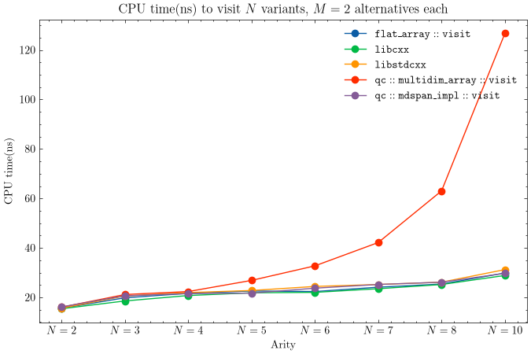

# Introduction

A month ago I published a custom implementation of `std::visit` that stores function pointers in a flat one-dimensional array. If you haven't read it, start [there](https://quantdev.blog/posts/implementing_visit/index.html) - this post builds directly on top of it.

# `visit` implementation using flat arrays

For completeness, this is the implementation of `visit` using a one-dimensional array.

<iframe width="1000px" height="700px" src="https://godbolt.org/e#z:OYLghAFBqd5QCxAYwPYBMCmBRdBLAF1QCcAaPECAMzwBtMA7AQwFtMQByARg9KtQYEAysib0QXACx8BBAKoBnTAAUAHpwAMvAFYTStJg1DIApACYAQuYukl9ZATwDKjdAGFUtAK4sGIAMykrgAyeAyYAHI%2BAEaYxBJmABykAA6oCoRODB7evgGp6ZkCoeFRLLHxXEm2mPaOAkIETMQEOT5%2BgXaYDlmNzQQlkTFxCckKTS1teZ0TA2FD5SNViQCUtqhexMjsHOb%2BYcjeWADUJv5uBACeKZgA%2BgTETIQKZ9gmGgCCewdHmKfnzUel1e7y%2BZn2DEOXhOZzcYUyYjwAC84rdaHhxiDPt9Ib9/m42CwSMD/G9seCftC/rCvI50VcsWCIVCYecAG7NPCGAiMnEs6nnBg%2BOJ4Uyk0F8vGwpzjYiYVi8im4qn4lLEMI88Xk5lS878YgsJiaslMymstyPBjoVAsXmfZhsBQpJjbY4AR2QIBARE8LwA7FZPsdg8cCJgWCkDGHYeN0F6Mij7gA6FPHAAieDYDAyAheWo%2BIeOaGzYdUauOTFpqGO0S8dHQtzQmCoVAUt0BTEuEBWJgDoMLheL40wZeIx1jXo7JLcE5ACbuBFI4%2BRmFQVBTSYgGazOezPdJx3wO6yClOAfTmcYu4UG7PabOgYLA%2BDQ9L5dn8/uRdQzdbt3n/xpsuKJrhuW6XtmJ77o%2Bz7BrOU4xgQcZziu9xLk2LZtvOrzfr%2Bp5nEBvZWH697%2BDBsH9rBGGtiYACsFjUVhK7HAAtMcXB0YR/hARxZESkGsH6hAGrHHgRGMf%2BzFsWYvakRYon/G83HHBoD6iSxLE9n2AmwSGjF0RYYm0VxQFHleJ4GXgpyWOxnHHAAVLhmGWdZ8kccZD6Uc%2BsleQOcoEJsDBOTRfE6XevkAPT2b51EGapxmAccbJcABjm3o5bIGQwLHuUB2FhbF9G5YlbJmKlxwbkmDmZfR2XFflT7BhuMU/i2WUsTJCUEUl7X1SuLW/r1dndRxYX2RFvlhhGUaYIhyGfgQt7buZuaMoWH6oQQ34liO5ZELcXANmEWCqBAlZELex2ipgChaeRz6vrtY7wcQQJzfGm1LvOoEpuBx65vu2CHhB15nvJy2Qbmt4%2BaFjUDo9o7jkhH2JltEkAd133rr9EPXtBvmDrmb5jud1aMYltb1o2rV/gh5y4yezWkt2am6Wz7Mc5zXPczzvN8/zAuC0Lwsi6LYvixLktS9LMuy3L8sK4rSvKyrqtq%2BrGua1r2s67rev6wbhtG8bJum2b5sW5bVvWzbtt2/bDuO07zsu67bvux7nte97Pu%2B37/sB4HQfByHodh%2BHEeR1H0cx7HcfxwnidJ8nKep2n6cZ5nWfZznud5/nBeF0Xxcl6XZflxXldV9XNe19nvkEyG/mBac9HmAAbJxMabbeACSebYBAs7HSO/6YG6XiMNssL90z2B3Y3z7N8QQVQPp9H93ZjlXdst2uRVKb42FhayUPyMgIaADWdwj6oY8T1Ps3nOj/XMysR9wz52JhVFvlCF4KQ0hKGOAAdz%2BAgJgbI/gEAQH8MykNsz4kCMcWiS4ZIHkMOgUMsDvwkHwMwMMp4IBcCXMgrgKwky%2BWIaQpc5DjiGhSKeIg2C/jonCM0USVoRzsT9FVXy41%2BJwympGI0T8Zw91TAzVa%2BZCY7URlgQ4VwbhnSrCsY4VBiA2gOkdLhp0FqcMIH0MMd1TjHxDPo8YojErwmEE0aMsNdKWMcMgbaw5Eak2CvhZSlNaANgknTNwUjsxzxZg42CL03rnAWl9FcP1NxBNujhNAeD/TETkovdRJAh6bVEkRVSJE1JWVhMBVc2N4kgygmpaw1g8ALzMQ9VAKTLLDWUk40UjYmCYiiZtV4Z8rERU8c04yH9OZOL%2BCxbqyTiDoBePRIyQFHLr0Ml3MJ3kCn1OOMvIKUyZmeTCl/L46yvifAigMoQmZIx/FEMAtcxwzBJU5NyF49pWA3WdK6D0RFIrRTCg6N5Lo/gjlYJcr5384brQeF4Bw6YfAsGBH2ApqyBzCJmrCJRjBXnHAACprVgl4DIRhjgAHVHiALiIlWcxZ8D1GYLQe470QAYluGyVAeAGyZXODi0kpA0ywsuKQLlSlHyCN0ii0RaLrgYrYMcAAahiQgJAlzor%2BbKx5ggNBKslSqmVaqCC8RNLpBRtB0UqKIGotk8qCAQDlRkIgxAO4dySpaxVqr1Tcg0ElDVrquSCC4ElchoLwVUSJk9JGyEAkbVRmgnC8DQbdSImGr0HI3WCEkomDlbgdUpoIKpbliaQDJp9QQNNdwM1ZqLfq8KSLdII3fOffRbImjRHoCWxKZ9kKFu5CW5lsJy3upwo5WcnbU2fjLbq/VIyOb4rCMAIsnSbpfkxvWh4M6ID2RWNa51ZBvXuqXH231k72ZtJcbWkmVYkpNvoGDDJukDIrPEajPuVproD3bV6W%2B99J6QjEb3Z9u8551KDdzLZ%2BaAnXIXYuSQIJtJAb5ne4ym7bUkCdQoPduqPVsi9fuvV/qTE3oFqeis56WBeGNXgW4bLVCJQ9F6H0tAFBeg0Vow6FHdGwjMKQdBg9f34F3oesWIGLUKDfSAYAmBNQElI44Cj6BVBxRWYPTDax81iYkyRsjMm5NFQUxAZK789mwc5rJaGiL7pwY2bekiImr4310Z%2Bx%2BsJG1MGbXcbCb8ewWZDDDYVnngyCcvbNeiNHvSNPo7R1A2jWMnXY5x3pmGky327EuZKCXdHdh7AhoTCrt2YeSwG6tXmjkn1M/wia2IjmgjFfYi4WrXm3jcGIAwLmB6gllFCraNrsvHBAMcBrtAmv0BvCmQNhZp2Er6wNm6XpUA3EeHa7sTNhUlbBac3rGBMBiaCmxBABACCMJAKc4AGBoieEWiQYAEUkQRWIJILgTBWyYEkHJl5jp3l/GC1QKM7ZXqdhGyGKrAoas3G1VuzVwO6upmwy17%2BABOI1JrSbmstYhrrDqzDtyy3atD2b8Lo47huNke8/sNLkXW%2BaOSnMudbd1ETw7i2joZXKIkUDGxsjlFQel5wocggPGlQ%2BBmMmrewC6BAxxGAPEuJwlhF7nNXoUAgDYvjjgQKgdL%2BXTAbitysAhzrdqUPZex0WobVVCcLyK3igls65QKCk4u5S8PJUif1CA5o6Be1bri1ujds5VOwlzYPWczvXe9t1a%2B03FDD78dG5budSg2xbW6tb23Vr10o7tWj9uhunkZ43B/DJx7XHEyI8wyn9Bids3g6RB9C4n28Zur04edmlAP2/TPP9N0APl85oRiJv2on1s%2BiUuJ1rQ%2BA2Bv9RB8bzxDt1d2jNs4meoBZ8gNnzZOeZtDzz7AJn0m%2BfhiGxGkaFwy6pxjZStPZ8M/78hRfy/V8c4k9z8UvOD5JijxzEDvfpzgfj8lgLJboMzNeZK808SAM8UMs9BAXg8d0dbxTdWIcIk9jV6UYNRZCMPF1NpNKNqNPQQtfRGNNEWBItb4GU6c59Gdwwl87gV92d18n8lJt9htmYeMX139%2BYQM708cPJulH1UxN5mZG8Tp7NW9zhZ4mD54u8RZTlBMMQoBj0OkukZxz4yCxAwwV4jQ8AWc1MpNyNKMDJN5jIvpz5b9qD786DN9n8GCRNfdzhMDdDZN9DZlSJFNbp35c8DNJZP9z4g9pl3ckN7VmYhMN17JrDxMKMqBYQ7DNNHCdMO5A8SAXdfCucLCXD34I838PCRZT5ZwbMotR5m8v1p4eDSkwIodAZ0tMj%2BZjNhs99itd9DNCs0xrMmBr48i74CiHN2R/83NB59MNlvMRVYIPEillJgs6MGMQtiC2Nr8k1L9UJ59jDKC79aDH8UjXgQlCdUsToFt%2BcCs/NxMW5S9AtlkEN4jiBEi3cucPdAivcjDkIfDLiN8cc4tbpbw88NAYcDkviwURIFBgUW0vAGA8B9QiDLRrQWBhJBAKwlwRJohAMIUNCXEci9UYcYd/A/RjhNs4gjQwCAwF9MEtEsALVp4EUmitJ6iIVkJATgSSAiCNRbh8BZQ8BawaVpRBAY0MQrUmAlw4TKjNkDiV5gZxhoBGBsS7U88KtPgWU2VQwbpi07DLkGSMRnQCBkAEAWZUCQwPFAQKVz4EJzx89lDdU2TFx1FaBUAjQlxrQvAXNADJAZISJSBDSO1jTzgNQlxPsLTTTrTbTxQAx/AkwuBaIIjHTnTZjs0TSPTzTLTDwNhfS3gAx24kwNBwRMBwQDk6iBcwoj8vxiA/VMZ/i7hqSQTbgwSbQIANUzB%2BMcytpiB7kCzpoiygSSyyyITKz3jjk4YPFkpEpAQDI8yVkzNuz6zlI%2Bz6I6zBzBjgwPEkCE9RjcDPsjRvsgQk1kcMlddcSgCKI24EN3TOECA1FnwJkDwPwV1CUE0OCzAzBITTSNQewryqlQy98QC9zPSjRDyQxjygZTz1RzzzxLzrzXzoyDzzB0F5JZInTnydymi9yfT6APyECTzl1fzZ0LyBSgpQKbyrS4z4LQLHy0xIKGjgwQC3zbzBAELELvzkKZ0wZ%2BSApBTMLSKYTyK8KyI7xCKjNoLqBgKoyvSPyvz80mS/z5IALuKvTeL3zWLwKnyiKtdOIxKYy4LMBDyBKfyaK0L6KMKryFLvScLlKpL2L8NiKuKlLmKDzCxVLqLhK6KW5MLTL9z7ywLDKoLtcmj7LSKVKcI1LrLRL3LgLHL8KOKOYQD7KlK1FLL5ozzUL/z0LrJrzQq9KAq2KIKMkUqNlkpksZIwoOzKSvQ0BaR8RilQLZzAJQLCrzh%2BSbdjVyq3A4q6I3AGApKJRJSPgRJDQwgNSzNCF5SdDFTGSVS1TQkls0wOA1haBOBaJeA/AOAtBSBUBOA3BqkbIFANgthqRwQeBSACBNBRq1hL4QBaIuAkxEgNBaIYc/QTq/Q/QuB25JBaIzBUFxqOBJApqdq5rOBeAGMNVtqZrRrSA4BYAYBEAUAbQUg6A4hyBKA0AIxwb4hDhDBgAryuANUaBjU4gGMIBog3rogwhmhLhOBNqcbmBiBLgAB5aIbQboH6za6GrMAgUmhgWgfG360gLAWsYACbBjbgXgLAQ0IwcQFm/AOUHoKBLm2akcboWkHYTajUWoN69EaIR4EmjwLAN6ldFgAm3gKBYgE7JQNMcMBGthUAX6tYRc4ABQOVTAEBUm4HTWmQQQEQMQdgKQe2%2BQJQNQN63QEhAwIwFAJamwBWhjSANYGbGlLmliWMAiUwSwawcEViUmswXgKg16NlKbYOmoOoLIFwK0KYPwEhEIeYMoCoPQIBIobITwdoEuwoGlQYIupYDOqm3oWYXOvQLoHoBoWYWu4YSoWwZuiuvIEhSxFoLuxYSoNYFazYbYCQMaia16lm%2BajgY4VQRIduFiW6osH22dK8wM5M44CAXAVHDalYXgH6rQd%2BUgfayQRIQMmHSQFMrgGHK8xIfwWiSQGHfQTgF60gDW2iDVaa2ahez6kAb6natYAG4GiW5AKsMgCgM6Ygc25QQwWoIQBXEBaamm0GugDQgQRB8IWgFB1ANBt66GsG%2BgOGzepGjVEh2GiIV5D60gahsh0m2kAhohlmyBj4eBrm3gSBxofBeh/gB20QcQF2wRt2lQdQFmr2/QBGv2mOywfQZkoOpLUOk8TgCOpCKO/2uOliBOpO7W9ULAZRtYYgQExwNgLFULYx9YSe523u/BXB5B1B9Bk%2BuUdgDVEBUlTWmejgSa0gf%2BpOzgbAVQSWvXZe1e9e%2BGwlbeo6j1CARa%2BRmwY4A%2BvXPYchE%2B0BtYWBJgLAeIJLJ6r%2Bn%2Bv%2Bt6wB2wYBrazJi%2BkAK%2Bm%2Bu%2BswB%2Bp%2Bl%2Bt%2Bj%2BjgfwOegB%2Bh0%2B3alpxO/xkpzpyp7W3capoAA%3D%3D"></iframe>

# `visit` implementation using multi-dimensional arrays

A multidimensional array is an array of `T` elements, where the type `T` is a generic type - either a scalar or an `array` itself. Hence, a multidimensional array can be easily coded up as follows:

```cpp
namespace qc{
    /**
     * @brief A light n-dimensional array.
     */
    template<typename T, std::size_t Size>
    struct poly_array{
        T m_buffer[Size] = {};

        constexpr T& operator[](std::size_t idx){
            return m_buffer[idx];
        }

        // Base case
        decltype(auto) constexpr at(std::size_t index){
            return m_buffer[index];
        }

        // Case with a pack of indices
        template<typename... Indices>
        decltype(auto) constexpr at(std::size_t index, Indices... indices){
            return m_buffer[index].at(indices...);
        }
    };
}
```

The `.at(std::size_t, Indices...)` method accepts a variadic pack of indices. As a concrete example, if I define a multi-dimensional array `a` of dimensions $2 \times 3 \times 4$, `a` is a collection of two $3 \times 4$ matrices. So, `a.at(0,1,2)` is `(1,2)`-th element in the `0`-th matrix. Hence, we should recursively invoke `a[0].at(1,2)`.

Next, we write a helper struct called `dispatcher`. The `dispatcher` has a `static constexpr` method called `dispatch` that invokes any callable on a pack of variants. It's basically a smart wrapper over `std::invoke`, that checks the return type of the callable at compile-time and dispatches to an appropriate branch. 

```cpp
template<size_t... Indices>
struct dispatcher{
    template<typename Func, typename... Vs>
    static constexpr auto dispatch(Func&& f, Vs&&... vs){
        using return_type_t = decltype(std::forward<Func>(f)(std::get<0>(std::forward<Vs>(vs))...));
        if constexpr(std::is_same_v<return_type_t, void>){
            std::invoke(std::forward<Func>(f), std::get<Indices>(std::forward<Vs>(vs))...);
        }else{
            return std::invoke(std::forward<Func>(f), std::get<Indices>(std::forward<Vs>(vs))...);
        }
    };
};
```

Here is the complete code-listing.

<iframe width="1000px" height="700px" src="https://godbolt.org/e#z:OYLghAFBqd5QCxAYwPYBMCmBRdBLAF1QCcAaPECAMzwBtMA7AQwFtMQByARg9KtQYEAysib0QXACx8BBAKoBnTAAUAHpwAMvAFYTStJg1DIApACYAQuYukl9ZATwDKjdAGFUtAK4sGe1wAyeAyYAHI%2BAEaYxBKSAOykAA6oCoRODB7evnrJqY4CQSHhLFExUgl2mA7pQgRMxASZPn5ctpj2%2BQy19QSFYZHRsRV1DU3ZrQojvcH9JYPlAJS2qF7EyOwc5gDMwcjeWADUJltuBACeiZgA%2BgTETIQKx9gmGgCC27v7mEcn9XdnTxe7zMOwYey8h2ObmCaTEeAAXtErrQ8JNAW8PmCvj83GwWCQAVtnhiQZ8Id8oV5HCjzujgaDwZCTgA3ep4QwEOmYxkUk4MHzRPCmIlA7nYqFOSbETCsLmkrHknGJYjBTkikkM8UnfjEFhMNXE%2BlkpluO4MdCoFhyzWKqFULxgzpiLlvZhsBSJJjrA4AR1McSsbwOwYOAHoAFThoEh4Phg4AAQiKswVAOrwOKOACAIBwYAFp8GwGKkBGIDn8mGcAHTRmNx2sh8OhhsHAiYFiJAxtqHnS5u74AFVIB0m6BAIFSiJuByECMwdJjUq8DgOyVoZyuFYBAZbMYHBxYVwiXioVGiJgArBZZ4jLwARH4Pkw7uJ346B95BmMhtDFtuqZUDgHcwADYDlQS47iIYhLysC87wgUdx0na4czwdBVAWZ8P2/XCDmlAhVgYA8jxPM8YKvdDVHvd9dxDZ83yDOjgywPZe0wCAmCpVAFgOX9JkwADiHLAhEIIMcJznadgiwTDsOY78CKIkjj1Pc9KPNQSaK2HC8IYhS2w7Lt5xOdj%2ByrCyDgASXNIVMEedV0zw1jaHYzjuN4/j/0A/UxIklDpM01Rhxs/B1gUCyqwOGS7IULCdy/PCQyU4hiMPVTyNgmStPgqtfJi8LIqwnSFP0xKjlfWiMXKwzO31Ey3ACghIus2zwoXEMlxXfAPX1ZAEHPBKnNw2rjJ7C5GFYb4ADEHWQYczKmlqADUHMNJLJn1IU%2BIEAShPLbiDh6z0CH6iBZrBUDQIOKhh1Wq6zBAlrmTi%2BTyqSrxUiMfDMEI1Kbgm6djgfFy3KQkAdQAd3qdAoQu4VsGoBY/PHYBfqhDQnhRiGSGh4hYZOe6iQgF6FgWIrit0pLgzwVMvME5VsdRK4FCmq5mShFKGABy4bmHZlUHQp54qp6nF3E8dggFgBrDjwahmG4bmrGqCWEcJZANG1TcULYqx%2BXccVwm1pJuLyYsymFJjBj2iUN7hrF5LfuU8GpdQWXsYV/Glcu4nVeHcGtahXX2uJg3iDxgm3CJxHSfNqtLfevTKqT4N9JK8r04/FtRvq8a%2Bymg54YWibzMs1aA6k5rLJD%2ByOuDen9q4ogDyYWWrmOvqECZoKWcwH0vEYdZg7a%2BzIuF%2B2kq5o7URO/rzxOWuIosp5x1ztsZ9606EB9%2BaDlW8eRQzh2ys/B2Iyjd640TZNUwHAbW2iFhgjLUQlGHSGBuIyHvnqX%2BcwIA/egTBUyoFTIA74LAvCuTwAWPARYSzMFoLuOMW4axX2bDVdsdVuymVLoXYurZ8FsBWgoSuU5q5RSsmtFsjcfKHT1O3e0YIrhrg3FuK48DOw91kn3AeQ8GrUMPtgEWClp6MOuJ3beu87rLxrGHDW2VVB8MHmCQRcisZkyqifFOZ8YwXxQQmJMeAUwHA8H%2BYgy4CAKHLAcLg6A8xbmikFTA6ADgRDOLmAQeZ2KPyMvVVc9QpptmEsHORpAABS9dYxJU/ikb4Mp%2BoHHaO2RgaEbFMB%2BsgVYqRmTfFELQWgrZUCtyYXNVhnh2HEH%2BJwoyKDMEO3Xg1RabAi5zRLgXEh5cyEjiri1ah5DUItQiT0lpmAWpCH7jQ8qdDhLNxKRIq4zDkAVPXJuaplZancNdr3JQ/C1FhOEQHRRuz%2B6qOHicEZRyZxTJans16Q0PpfWAD9BQ0CCBAy2CDKorkJoQEWcs1ZVSalcOQScQhB8V4KIkkolRAjDkWVIJjYmat7kU20VPZ2qVVyVPWf8Tm9l3l8xQmAyKEARnFWeAGA4/y27XEBWwvFmzQUyP3ho6FktTn7IuTrcJBwRmaIDrci28cs4tlPjnbBY08GdJmu0ohsrSHRNmQdFuALymMq3BAURqcfp/TSnSpZGrcUcJZeC%2BVkL5GIx2bwvZ5yGqCvVhJRZsK7XwpOODVkKoOQsykhzD1GtpT4jyVcZAzJpRUBuFCGOgIUVFQxfRXRErXRTV6t6P0a9UCeEeI8kMTSoTgyai1O88DGCIOmQ7FV8z3FeDoOgUNqAUxUAUEys42rJ54RVeDLcBaNZNUGaSiyEAS0IPSK9IkM9R27QqhYA4I6y1jpamK3VXa%2B1Vx2k2ltKFHy9MRIOqsw7S3FjHYnB24sJI9oDf5Kuw40Cbt9beCdd7Tw2OBjO5dZ76IrsbS%2B2Cz7m0Pu%2BHmOx94d1cG0QpHUEBVTRWwv%2Brdc4DjAbMFnaKPxnhfIOMi2dsC8w6s/bheDWVQNvsLAu3aWUjiWBA/BA4cYiOUSo7O8D8EE24VPpi/VG7f3H2tro/Rl9K0/qoLBTGtG33Mi4NuuMLU4wcyvPmFjD4UK0OE7BJTO7mRmGkwcSKUVwzyYsIp0DKnyrjxmWphTeYUPicw4Z4ztHTNCabbBBzT5MPgfKk2SV/jcGNTXRQ4tR7y3RMLeulVRArj2M4UFdyRAWoFXsvhpKq6L0bMJP569FCB1UDJfO49u1KWTvI8WGdc7guLssh%2BlLu1vLCTCxQ7jAHt1vpJblod%2BXy2npq3%2BBmczDrwZ3ceOtDb72XrcJ1yrVr206UdnN%2BbC3FtLeWyt1ba31sbc21t7bO3dt7f2wdw7R3jsndO2d87F3LtXeuzd27d37sPce0957L3Xtvfex9z7X3vs/d%2B39/7APAdA%2BByD0HYPwcQ8h1D6HMPYdw/hwjxHSPkco9R2j9HGPMdY%2Bxzj3HeP8cE8J0T4nJPSdk/JxTynVPqc09p3T%2BnDPGdM%2BZyz1nbP2cc851z7nPPed8/5wLwXQvhfU3Fbq6esErqsY9X0muJsbWCThQcxe7KREdrFtPKADGLDUNA3GRLcUmO6Ytmx78DFsYuq5faqE8HAOaO64mxieiQwRhbEILwiRcjfB/gcBATA8mtgfmRgrpWoRbGHBeYcKGJ2GDcRAnaJB8DMDbDYiArQDjh7seTFsafhyZ64LxPUiQbEt3jyiEI9RnGyTsXEKKLZvPVUaVKvOMvAuWUmxRxyMYVWgz%2BfM3iVBiCWii/WpRiF10wmEHUNsIsji6qaurAJb7J/dFwaLcWW1kA7V603AbwnX2YeG7Qettvxsd%2BLMImb6/Ooa3G/23dmB92HqncWIraBE85qsJVXjeEoML7wNhJjN/jhjiA/k/ufuOrOtYNYHgMlo7O/vjI8JRCRphptI4Csm/NrE1PrNPt8KGE1kgRYAAfBA7mLGgUBm%2BggegIQcQQ%2BPRvvsRtLtfmnPxnhNPFQQ5KLBKkmm8PmjKpNF0lFG4GIAYBEPQBWl1DmMtKiIQCQAcCAGYiIUwGIWPCvLmsGJ9MEC8sIYUsoeIeOBBNEPqCQNqofNnMAaKG8KGPgQAOIYARCeAEAKHZgEDF4gDWHAD2GOFVgkDAChjwihiSAMAADSPomACAPoXAnmrw/Yaa3wfo6uYY%2BBMR0URkqSggW0Ag4EqYzIMhOYmh30UCMCcCL%2BZYW4jw5UsRno3oRRjghYraiRMYfBpwxC3w0heQJAHSAh4y3S0S3etWfWR0Pybk/eBwuReQEA7RshMEj0104x0xsiD0T0lkpMjReE1agKdQKhO6GaIA6qLCmq6W0aeRnRbKl%2BpB1MGxc0O6mxeh4yvkL0VYY%2B8cFxnGykyynshs3shMJxMExM8x0EqKGsXsUcMcpsLxpufGTuUJooPBZ8MGrMaRVwDotMJAh4ZoFoLA0Ggg5Yw4MGEQcBwYaB204MLABAXAAAnBSVsHEAcGjCEFBCQNhODBicPlgLkcPC%2BAhPFG%2BD/kSRrCiTqIeKqB3KiLcHgMeJ0BKIIE8JvKJEwMOASabtPD1KJPSUYYCRBnCQLOhI/JMFcLUXgJ2JIrPF3O2uoaqiUn8Dut2kcdSgpJ6myByNKQQMOFQLQKgPqMOBaF4CoYCAGJIChq%2BKQA6RrF6uyDKScKqG6R6V6UdCsH6SKAGFsFWFwBeCJsGaGRJOGc6VGYIDGZ6a6fGb6fQP6RYE9BoCCJgCCBxo7hBuVA1qhPhFwDaawMaciQwKibqFcKyViRoKQGYBcY2dOMQGYK2UiYKWiT2bHpaBAP2YOfWc7sGNWpJjun8LBMQEpqbiuWOW%2BuuVeKOdpNnOVNWtKG8q5DscgOOIafUVuOOACRAApFMdBGsexlePeNiUWaqLxLhHmLKYWuKd9NhHqspOYGYJ%2BXiYIFhGYNHlAZmbqtbO%2BfBBBTdLGQQD%2BSGH%2BROgBSqEBdShLjBShe6YWdBbBRVHeCGQhfREhQhNGcWSoRhUhv%2BX2oBS8sBQReBXRT6QxWBe%2BORZRQRmbjRdQGhZBehd%2BFhdgE6shKxWVhxSJYWWJaRXxQxAJXNpLshcRXGVpeJcGJJdJROLJexVisRGBQpdpWhcpbNqpVbNRXBAhDpd6QmfQD%2BfpThVoXJSZVRuBY5fRS5bxdZfBYJYhfZRANxfQEpTGG5SxbhWxfhV5WZeFZgEpQFXBRRbZWnMJUlQWfqK5cxf5EZfFVxolc5clahSRalfxRlUcFlaVU5SWZgLxNFQVbFZ5cVYRdlX5Y1ZVTZbqr1YJZJvzChuVKei2ODGgFSDiFCN5Wee8o%2BGBVNScK8nNVCNNbxReG4AwKlbCU7kCDBnqMEOaaLCnh8oae2VImdKNa%2BBwEsLQJwBeLwH4BwFoKQKgJwG4NAdRgoCsGsBSCCDwKQE4c9TdUsNLCABeFwFWAABwaAXgUlxAw1xBxBcAgSSAXhmCR53UcCSCPWaC8BvUcC8AKAgD9lA1aBLBwCwAwCIAoCWiJB0DRDkCUBoAdgM0xB7CGDAAwVcD9k0CuTRDE0QARB42kARAvzEBnCcAA1i3MAS0ADyEQ2gVQQNANLNRYBActDA64ItWAx4wAOhtAxN3AvAWAeoRg4gwNpA%2BA0o1QeSRtL1gkVQVIGwANqo7QItKISY9QZwHgWAIt4pLAUtvAeSxADhSgd47YnN5eoAwNSw7pTAwACg0hmAkMctfYQdMgggIgYg7AUgmd8gSgagItugrQBgRgKAn1NgntxNkASwEEnQRteYo4wMpglg1gIISGctZg%2BNIdKoWANd2qbQHQ6QLg5oYwLQpAgQMwxQpQOQKQaQAg49c9eQ6QfQM98wQ9ytNQUwS9EwKS1QAg3QDQa9AwZQtgO9ngzQegm0x909p9EgSw31qw6wD9%2Bg91uNltBNBwqgUNIEeYqNfEZdLyMFqZVYGgNKuA0xVGWwBevAZNINpAYNkgUNqZFJkglZlJMFUNWwF4kgFJb92NvAgdF4/ZT1L1BNRNJNgNeNFN1NEASAjt2S0ETNnExAidyghg7QQgCAqAkMT1qtdNdAmRDAHDIQtA3DvDZDvALN9N9A7NQD3N/ZMjbNoQU0nA0jgjcjctVIEjfDItjDrwbDRtvAjDtQSe6j%2Bd2d4ged/AggigKg6gltJd%2BgnNFdbdlg%2BgEpA9ddiQDdnATd4kLdldHdeYXdPd0Qfd9k8ASwliggpaA4Waht0Tywz9ud59SeojXDPDejxtgN0o7A/ZkMdwiQQdt179pAUjr1nA2AqgTt0E39v9/9kggDnNBwIDkN4DEAH17jNgBwkD9T2wsD1DsdSwA0TAWAMQg9WNONpAxDpDItFDtgVD8DZMiDIAyDqD6DZgmDZg2DuD%2BDWNWwH95DFjKzZTHA3dFTCzpzNDSwIdiC6zQAA%3D"></iframe>

# `visit` implementation using `std::mdspan`

C++23 supports `std::mdspan` a non-owning multi-dimensional view on an underlying $1$D-array. I present below, a `visit` implementation using `mdspan`.

<iframe width="1000px" height="700px" src="https://godbolt.org/e?readOnly=true#z:OYLghAFBqd5QCxAYwPYBMCmBRdBLAF1QCcAaPECAMzwBtMA7AQwFtMQByARg9KtQYEAysib0QXACx8BBAKoBnTAAUAHpwAMvAFYTStJg1DIApACYAQuYukl9ZATwDKjdAGFUtAK4sGIMwCcpK4AMngMmAByPgBGmMQSAGwapAAOqAqETgwe3r7%2BQemZjgJhEdEscQlcybaY9iUMQgRMxAS5Pn6BdQ3Zza0EZVGx8UkpCi1tHfndEwNDFVVjAJS2qF7EyOwc5gDM4cjeWADUJrtuBACeqZgA%2BgTETIQKZ9gmGgCCewdHmKfnrUel1e7y%2BZn2DEOXhOZzc4SyYjwAC94rdaHgJiDPt9Ib9/m42CwSMDdm9seCftC/rCvI50VcsWCIVCYecAG6tPCGAiMnEs6nnBg%2BeJ4Uyk0F8vGwpwTYiYVi8im4qn41LEcI88Xk5lS878YgsJiaslMymstyPBjoVAsRU6lWwqheSGNMR2s0CgnoBSpQzu5Xm5ATdBYKi8z7MNg%2BphbY4AR1MAHYrJ9jmnjgB6ABUWdB6bTWeOAAEYurMFRjh9jujgAgCMcGABafBsBiZARiY6ApiXAB0efzhYH6azGeHxwImBYqQMk9hVxukb%2BABVSMdgyAQJkUfdjkJkZhGfnZV4HMd0rRLrdu8Dk%2BP88vjixbjEvFQqPETABWCz7lHfgARf4gJMO9EwAs4Uy%2BVN83TNA20nVQ1WOZdzESY5UBuR4iGIb8rC/ACIA3LcD13PB0FUZZQKg2DaOOOUCA2BgnxfN8P1wn9yNUQDIPvdNQIg1M%2BLTLBDgXTAICYWlUGWY54ImTAkOILsCCIgh0E3bc7nrcIsEo6jhNghimJY1930/TirUUnjdhouiBMMydp1nQ9znEpde0844AEkrVFTAXi1Ks6NE2hxMk6TZPkxDkKNNSNJIncdKs1Q118/AtgUTze2OXT/IUKi7xguj02M4hmOfMz2Lw3TrII3s4ryzLsqo2zDIc4rTnA3jsU6pyZyNVy3C0%2B5sp8vzMqPdMTzPfBowIZAEE/Irgto/qXPna5GFYP4ADFnWQNd3J2saADVApNEq5kcZA5IEBSlK7aTjjm30FoQCB9shNC0OOKg13On6zESMa2QKgzOpKrxMiMejMEY8r7i23cziA0LwuI/UAHdWnQWEvrFbBqGWeLN2AeHYQ0V5SZAbHcdhQHSQgMHlmWFrWrskq0zwCtosUtUaYxW4FB2242VhMqGCRm57jXNlUHI15Cs5rnj3UzdwnlgBrCTMZIHHiDx84CepqhVnXdWQHJzU3HS/Lqb14gDaNtxGaJlm2c8jnDPzAT6iUCHVtV0r4ZM4jNdQHWabpw38YO03zeI63YTtyamcd52GYu5mCs93tvch%2BzusLtMHLazqy6g8d1sGzbFx244CaOraPK8861xGggxtTgKprTPnHqkognyYHXbleo1FsFlLhcwOMvEYLYU4mgLsqVwOSsll6MTexbP3OHuss815Nxrydt/mxa48hAGj/7cVy6DjroKD7Nc0hwsSzLCtlyWid4hYOETsoglBrixktZiWM/itGgfWAgf96BMArKgCs8C/gsC8GFPAzY8CtnbMwWg95Cw3n7B/McfUpwDTnG5FuDcm4TloWwM6CgO6kS7l5byF1xwD1is9Q0Y8nSQluBeK8N5bi4JnNPPSs956LyGpwtepJlaGS3vwu4E93rX0Oscc6iiibhxnkoWRkJ5F32pqzHqT9i4v3zG/IhxZSx4HLMcDwCFiCngIAoLsxwuDoEbDeXKKVMDoGODES4DYBCNnEv/Zyg1zytB2pOZSKc76kAAFJ9wLCVcBGQ/jykWsceoU5GA6S8UwOGyANiZDZH8UQtBaATlQCPARB1hGeFEcQIE4jnJEPIUHM%2BQ1jpsEbgdZu9cmFtxYeuNh3cpmdzGmkqZQzMBjSEHPLhnUeHKSHk0tRtxBHIDaZea8nSezdMkQY6RRiF4mJSXojultaqqBkTcpe5xFn3L3OssaRjwYrShjDYAcMFCYIICjXYaNMBiS2hAPZByjkdK6RIwhxtRk6LMenR5hi56vNMdlUgVMmaJ2%2BV7AuQd8xbxEScoEEsAqgtllpFB2UICLNam8ZMxxYWjzuPCqlYjkVaNvnoqRikXlyLuZ5NcizzEdxJfnPOldxzP2rpQjaNDxl7TRcs5hmStlPWHnC1pfLTmXAgMokucMEYVW5fso17TqVnIFaim%2B6LhWXNFdc8V5wZUWwSnsp5YrbnnGIhydU3JhakXFsGy2coiQ1NuMgNkcoqD3CziCB%2BRM85kt9tY5VEYdrRljAmU%2BqBPAvH%2BemAZsJiLzK8gBXBjB8EbKDnqnZoSvB0HQAm1A5YqAKAdaa815K4L3RispYiN5q2W07qwlETLPIQHrXg7I4NSTb2XfdLqFhjhLsbSusaiqLV6prWwu6vb%2B1aWAtMudVBmW7rbCu7NdEJ0mqnQlGdZ73wXoPK8T9far0GW6o/Eqhk0DnrwmBr9EaUTHEbD4wCV6uCWMMvqCAGpcrUUg326Dfw4NmErrlf4bwIXHEJdu7BjYh3Bz/S8TiCHUbrr3fdGqpxLDwYIscQsWHaMWDwKx7dSGCKWJA9Yzeodyo0eE/xUT6ZszcJ7e%2BPCVMOMMbZFwS9hYxqFnFj%2BJsgmgJaXk72vC%2Bmr1sjMBp442UcpZh0xYPTCHDOdTXpshTYZdONnwypkjdmHMcacy2tzeE/MgRI0hzqo4VWxOocNadMy60NofcxoKat32nr1UQW4vjxEpQikQMaTUApUbosey2k7o1paSrOzA87eyLsS02tljGktti3Tuhr%2B6vKHuHf3Ud/Nx1xaSjRnDV7GW3oXfexrUnaKtuetxq9r5O3dvPQO2Ek3Ov30zZBajO3dt7f2wdw7R3jsndO2d87F3LtXeuzd27d37sPce0957L3Xtvfex9z7X3vs/d%2B39/7APAdA%2BByD0HYPwcQ8h1D6HMPYdw/hwjxHSPkco9R2j9HGPMdY%2Bxzj3HeP8cE8J0T4nJPSdk/JxTynVPqc09p3T%2BnDPGdM%2BZyz1nbP2cc851z7nPPed8/5wLwXQvhci9F2L8XEvJdS%2BlzL2Xcv5cK%2BO0qi1W88I/SE8G%2BLOVOEOyxVcnFXrbYYuwMV1WW8oDcbwjrjjhZCsFX41Zr203YICRpv67Fxi3luG4zh8xT7S65s6nJzqQgvCpCKH8KBxwEBMBqROP%2BLYmOtdhLsNcX41z4bXYYEJaC7okHwMwScXiIBcDXKnnxbNxwl7L2uLgslDSpC8cPXP6IIitECXpHxiYcrjki71fpqra6a6SmNdbyXLojoQv1l6UKwowp2bJKgxAbRZa7U8oip74TCBaJOZWpwLWdwtnEhjW/%2BjUJVmrI0oo7pT8HnNtzXiGOLdoF2n35W3Bj7bMK/3sEX00uH9pNVrVvVhum2E1mgPnuWlYEBhfumKhofngNRFTDAYRrCNejVuNnVp/qututYNYHgKblzBAYbDxogd5gZjvqKAmkwJiAAampinEhmJJnRgRD/ldDvrhgxsQd6DVAhlxg/rwRrrAQHoJD1paiZNwYFCrMqoHh8EuIWn8MWrTLOKthWmmAMviMsjohiIQCQGMttBMjlKdJyNyM2pfjdDfg9MhOjPPpFM0jyioTeBAKdDoThEDOhGyK4XoToiYYIC8MDGhKDH8sIZYWOr6ppKemyC0DEPQCNgxjTKGlyIIDhmLG%2BpuLGqgPGomsmvQa7L4Z4umtgJxo7vnMhhahmEwdgDGAgIUoIMQOEuEPHn8FEUwDEX8AoAgOsC/tHrHn8Lnh0UwDcKcD%2BIBM4V4cpJ4cUN4cYWGn4UEcojJrRNDOEECnKCCmFOCpCtCjcNHPrPTOcC4VMbhEzJMbocQCTEnBTOcISvopbDHC7DMUkQUScbnOzM7vmMsbDCAgFJscCvSqpFmCTIcWce4QDPkf4YkIEU7o/IZNdNfrNsPC0W0RvMHGrhrsNFruNBlL3JiglAGp6kGrbCvMboQdRqVglO/ielVugcAY8aYU1oni1o/iRtROESAIkeGiNFGrFglBkVkUmuWLkXSX4YUQejAT7CVn1o9FSdpMcEibEZevESGvkSkdycRHyXcNkYKTbMKc8cRkUZptCSEWJlamye/t8f2gQHLNEQqT%2BuKGoQdmiYRMCW4QEcDHKRiGCbMQUW6SDF5CzLBr%2Bmsf8SiadgibsqCngOIhRFekoUQGWpuEvivtlk8mkeySqVyWmRqQmgKSmjqeCaKcfEzIfGwUdqriMQEeibWtrtnO6s8gSV7gokWSbqGRdhUVvJMVAHCYciAjbMqd6deGFPEIXngPGjbBglgtGdxD%2BNbgBA8ryVOJkZqbmUKQWRmrrglMnOcBOY4FOVbrRhBC8azFmu8WdlvBnPsa7OMdTJMSTFmDTNbOImGNuZGXuTOQedTGhBebHAcWue7LnCecBmdq7sRO7vrp7kNGNsyrqaupmqWbtgJC5mISJoecadJoRKBTaviQboSfKXcIZkSlRBat1iaSZHhc7jIaIaCFWuqgYSsl5G4GIAYG0c2jNPWAAPI1LEC0CoBMBYAhIgAuJMWtH0BmIOmfFAqMX1IiUBSbiYTxBGgkBmqKJVzin97yG%2BhFpJgqwaUxjoLei%2BhSwCoOn5g0UXCMJ/AuneHaptx/mgZSnWGz7hQL4enFBjFHHuGuVnFelPEQlQk5QsytkAorF/EbH1gMY2E7HEShQcgopXkeVEoQASm0TRWz6xVpkcnJFiBJIjljmUzznpGLn8k5H5nelcIZrKXHwWr5gWJAWqwSVyQ0E/HhUkbBlhUQCAnuUgm%2Bk%2BWmHuEtSnkzYOUDaVayl4VxEkYJEZmRpZlFXLklUMx2VrqGmlF1VczdmhHT5trwo2kChARKFUCOEmqbhwpHVAi7FOyXlWXHHuzjGJx3F7E/l5FlU3kFQDVrXsFX6HI0FKBtCCwXqizcmRUSQ7UyXmzRRmmvrnAWmyxym7W%2B4ZrwWwQVHHAhA9jrAEDKCeCijAjVWyZMEADqECoR7iDgIVueh1RoXYJqGEFYByjQ54Csgg8QSyf8O52CjJ%2BCnYTy%2BIeApA2gpAWsv6GII84ewSjSXYzEKCfa8M%2B%2ByF%2BNgSTRPifiN4Hcp4NR8CVNue6otYBAjYRIEwHeikxwwAo5AUFs6oWAjYXAXYyAmUTeTSuezoWA3FlwIVhIxIpC8taYKNv8ItItYgCgTSdS9AISy%2BWM%2BtTA2gJAGEhs8QOUAAEnIkdAnuWFJGFKjejbSFjeiMgOEgxsRAYJcBjbcDrXWOuJ0ZgnjHjT7UwVjCQFrMcNoNDPWDQBEH9DHesMpNDJgI2N8V7dRijclZmEwR8HbQFEHcQDnTjcPSjUIDcMgDzE4l4p0VjBLfBFxXAn/M7fEJeCFVwABI2DzcPOUsmvEHIhLcuD3jXfqk0ugEaEwLcFetFNQbQd7k1ZabmEzKDW0b2PfS0GakjeYdftta0vDZ4ZgGvQXZbCwAZX6NDR/bDcRIpJOCKRVhEdSf2U8aqbNXGvNdqYtS9RmnotTP/Y/UA%2BmKA5CFej/bERA1jHhGDL2OvgqkIcPVvAchdZnAcdeScXdQVbTI9Q8X%2BTnIBSEc/DmlRbIRKJ8OhiLM5HcM6DzCQM%2BJaNaCwGhoIF2GuOhjEIQRtaBQQFwAEAELsImCbYwApW4cmOqdnivlgJ4UvGBIRIVKheOMREo/qM%2BBqOPBiA8HgK%2BI0NKIIL%2BnNKpEwGuHo87lvGE9AJY9hCQGSnmh8PLORP/BMLcOzTOOojvJPB9IQW2oCKNmVq%2BhyrCZbJlTbBqGuIdbxVaS9OsMifaRYJIPhuBKQOUwlJU8E/U7U0aGuNaF4E0%2ByhYLsL2FwF%2BGGO0505uN0%2BcNU39Dxf0w00M/QCCMmCDBoOCJgOCBI%2BhWUUHDKbuMQDbQXawNk7cJ4yo6XXYxoykGYD/kc/WMQGYKNuc7EVcwaDc1aDaBAPc0k/3vmG2mpleoCHhCczZCrMC68wxmCz%2BC85CzI0HG2m1S1ftcgCdXA0Zc5LM64UlRapxbvbxfxUFfZCMQRJo/UxqLJLRI2L%2BjWv47DKyarmYGYJSzo4IFRKy9tgJB0zfU6ey4s3UzS%2BmHS2ugy%2BqEyxyiy2yws30wQFy5nrgdM/y%2BS4RAs4M20SK4GeK9Ooy0Csy%2BJsxOYLK4IAM40/QIqzyyq97cMfhIRPKxywq7BGK0URKyFYa6aSa9QEs1S5yya9a3OcPQK460K0aCK662ybKB69K0a6xmy6G/K1a7ZF1EG6q/az63U%2Ba6s5gDS5G%2B61K9ujK5m8s5q5awGym7y8G2qxAGW5gE69q/m3q5Kwa7G166y7Wxa/W4EgqxW8q2m7awK3WzU763m/S82zG0W3G968O2G729y5Wza9RkO129m1qzq26xO4W%2BIRJjO6uys1q326m3y2IVWxampnLPhp1AC4c5bGgLSPiGgSa6i8BCa4%2B%2BcKFS1W4E%2B9y1%2BG4AwH2xKLIehoaOEGaq2UXmClk7ERolPEk%2BBBwKsLQJwF%2BLwH4BwFoKQKgJwN%2B5YNYOuF3bGHsDwKQAQJoIh6sFrCAF%2BFwL2AABwaBfgBCJgMeJiJg1CSBfhmDp7IccCSBofkdYecC8AKAgApBkcYeIekBwCwBICKRQrSRkAUCSTEDAAKDKCGD1BCCr3ockdoDTh0BX4CAacRC0DaeoBYzoeYf6epB0CjDAA1Cl42d2fECRA7TCekDOf0DEDsW0jmeWeCfyfIAfCqeiccC8BBfNAF4ef8CCAiBiDsBSAyCCCKAqDqCSf816AGBGAoB4GWD6ABOieQCrCYSNBheNjBioymB4eWDgiwbsVmC8BLmdLkSyXFekDuKCANrLilq0BFdmprAbBbB6DBjhAmdac6ecAkcPCYDsApBYyPCpBTdSe8eoekBWdNecDYCqAKc4THCqB0eJCNiJCSAm120%2BIgw20QC4dWD5fHC4BnGsa7B168ASdaCsykBLR8WjADdUeSB0fjMBCSBbPGOst0e7BfiSBBC8f8ekAsASAaApAbdCfhe2Biekfkcfe8eNfreCfYeo9vcUekBcX4IgCSBAA%3D"></iframe>

# Source code repo

The source code for the above implementations can be found at [github.com/quasar-chunawala/qc-visit](http://github.com/quasar-chunawala/qc-visit).

# Benchmarking setup

I benchmarked the `qc::flat_array::visit` implementation against `std::visit`. The code was compiled in C++ using `g++` 16.2.1, with the compiler flags `-std=c++23`, `-O2`, `-DNDEBUG`. The benchmarks were run on Intel x86-64 Core Ultra 9 processor. 

```shell
╭─ ~/repo/quantdev  main !34 ────────────────────────────────────────────────── 127 ✘  quantdev@quasar-arch  16:45:30 
╰─ lscpu
Architecture:                x86_64
  CPU op-mode(s):            32-bit, 64-bit
  Address sizes:             46 bits physical, 48 bits virtual
  Byte Order:                Little Endian
CPU(s):                      22
  On-line CPU(s) list:       0-21
Vendor ID:                   GenuineIntel
  Model name:                Intel(R) Core(TM) Ultra 9 185H
    CPU family:              6
    Model:                   170
    Thread(s) per core:      2
    Core(s) per socket:      16
    Socket(s):               1
    Stepping:                4
    Microcode version:       0x1c
    CPU(s) scaling MHz:      23%
    CPU max MHz:             5100.0000
    CPU min MHz:             400.0000
    BogoMIPS:                6144.00
    Flags:                   fpu vme de pse tsc msr pae mce cx8 apic sep mtrr pge mca cmov pat pse36 clflush dts acpi mmx fx
                             sr sse sse2 ss ht tm pbe syscall nx pdpe1gb rdtscp lm constant_tsc art arch_perfmon pebs bts re
                             p_good nopl xtopology nonstop_tsc cpuid aperfmperf tsc_known_freq pni pclmulqdq dtes64 monitor 
                             ds_cpl vmx smx est tm2 ssse3 sdbg fma cx16 xtpr pdcm pcid sse4_1 sse4_2 x2apic movbe popcnt tsc
                             _deadline_timer aes xsave avx f16c rdrand lahf_lm abm 3dnowprefetch cpuid_fault ssbd ibrs ibpb 
                             stibp ibrs_enhanced tpr_shadow flexpriority ept vpid ept_ad fsgsbase tsc_adjust bmi1 avx2 smep 
                             bmi2 erms invpcid rdseed adx smap clflushopt clwb intel_pt sha_ni xsaveopt xsavec xgetbv1 xsave
                             s split_lock_detect user_shstk avx_vnni dtherm ida arat pln pts hwp hwp_notify hwp_act_window h
                             wp_epp hwp_pkg_req hfi vnmi umip pku ospke waitpkg gfni vaes vpclmulqdq rdpid bus_lock_detect m
                             ovdiri movdir64b fsrm md_clear serialize pconfig arch_lbr ibt flush_l1d arch_capabilities
Virtualization features:     
  Virtualization:            VT-x
Caches (sum of all):         
  L1d:                       544 KiB (14 instances)
  L1i:                       896 KiB (14 instances)
  L2:                        18 MiB (9 instances)
  L3:                        24 MiB (1 instance)
NUMA:                        
  NUMA node(s):              1
  NUMA node0 CPU(s):         0-21
  ```

In order to measure performance accurately and ensure that the results of benchmarking are consistent and reproducible, I describe my setup below. Ideally when doing benchmarking, we try to disable all the potential sources of performance non-determinism in a system. 

- *Disable turboboost*. Intel Turbo Boost is a feature that automatically raises the CPU operating frequency when demanding tasks are running. To disable turbo in Linux, do:

```bash
# Intel
echo 1 > /sys/devices/system/cpu/intel_pstate/no_turbo
# AMD
echo 0 > /sys/devices/system/cpu/cpufreq/boost
```

- *Disable hyperthreading*. Modern CPU cores are often made in the simultaneous multithreading(SMT) manner. It means that in one physical core you have $2$ threads of simultaneous execution. Typically, the $2$ threads see different architectural state(process memory, control registers state, general purpose registers state), but in reality the execution resources are shared. That means, that some other process that is scheduled on the sibling thread might steal cache space from the workload you are measuring. This can be done programatically by turning down a sibling thread in each core:

```bash
echo 0 > /sys/devices/system/cpu/cpuX/online
```

The pair of CPU $N$ can be found in `/sys/devices/system/cpu/cpuN/topology/thread_siblings_list`.

- *Disable CPU Performance scaling and lock the frequency*. CPU performance scaling enables the operating system to scale the CPU frequency up or down in order to save power or improve performance. Scaling can be done automatically with respect to the system load or be manually changed by userspace programs. The linux kernel offers CPU frequency scaling through the CPU Frequency subsystem which has $2$ layers:
    - Scaling governors implement algorithms to compute the desired CPU frequency, potentially based off the system's needs. 
    - Scaling drivers with the CPU directly, enacting the desired frequencies that the governor is currently requesting. 

A default scaling driver and governor are selected, but user-space programs such as `cpupower` can be used to customize this configuration. 

In order to reliably benchmark the code, we do not want the CPU frequency to scale, mid-run. 

We can get the governor of all the CPU cores, by running:

```bash
cat /sys/devices/system/cpu/cpu*/cpufreq/scaling_governor
```

I set all cores to `performance`. 

```bash
sudo cpupower frequency-set --governor performance
```

Since I plan to pin the benchmark run to a specific core, I will lock the frequency of that core.

```bash
sudo cpupower --cpu 3 frequency-set -d 2.3GHz -u 2.3GHz
```

Run `cpupower -c all frequency-info | grep "current policy" -A1` to confirm that the frequency was indeed set.

- *Set scheduling policy to `SCHED_FIFO` and set process priority*. In linux, the `chrt` tool is used to set or report the scheduling policy and priority. 
    - `-f`: Use the `SCHED_FIFO` policy. Once a `SCHED_FIFO` process is running, the kernel will not preempt with another `SCHED_OTHER` process, it only yields the CPU when it blocks, finishes or a higher (or equal ) priority thread becomes runnable. 
    - `10`: The real-time priority.

- *Set CPU affinity*. Processor affinity enables the binding of a process to a certain CPU core. In linux, one can do this with the `taskset` tool.

- *Disable address space randomization*. 

> Address space layout randomization (ASLR) is a computer security technique involved in preventing exploitation of memory corruption vulnerabilities. In order to prevent an attacker from reliably jumping to, for example, a particular exploited function in memory, ASLR randomly arranges the address space positions of key data areas of a process, including the base of the executable and the positions of the stack, heap and libraries. 

```bash
echo 0 | sudo tee /proc/sys/kernel/randomize_va_space
```

# Benchmarking results

The benchmarking code can be found under [core/tests_visit_flat_array.cpp](https://github.com/quasar-chunawala/qc-visit/blob/main/core/tests_visit_flat_array.cpp), [core/tests_visit_polyarray.cpp](https://github.com/quasar-chunawala/qc-visit/blob/main/core/tests_visit_polyarray.cpp) and [core/test_visit_stdlib.cpp](https://github.com/quasar-chunawala/qc-visit/blob/main/core/tests_visit_stdlib.cpp).

As for the benchmark itself, it consists of the following:

- Time to `visit` $N$ variant arguments. In this benchmark, a `visit(visitor, args...)` call is made to $N$ `variant`s as arguments. Each of `v1,...,vN` is a `std::variant<Type_1, Type_2>`, where all `Type_i`s are just a simple wrapper over a `double`. There are no heap allocations. The floating-point values are generated randomly at run-time from a $\text{Uniform}[0.0,1.0]$ distribution, to ensure that the compiler does not aggressively inline the result of the `visit` calls. 




